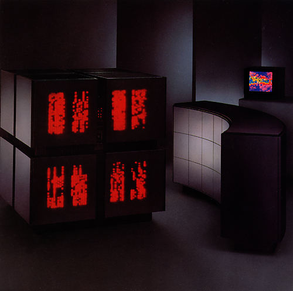

# CM5-Pixoo
A small project to project the CPU usage of your machine onto a Pixoo display device.

This is inspired by the Connection Machine supercomputer from the 1980s(it looks damn cool!).
It's front panels show the status lights of each CPU it housed and turned on whenever a CPU was being used.

This was made during the Recurse Center Hackathon in Bangalore in May of 2024.

## Running locally
Warning: This has only been tested on Linux.

Pre-requisites:
1. Python3

Setup:
1. Create a virtual environment: `python3 -m venv .env; source .env/bin/activate`
2. Install dependencies in the virtual environment with `pip install -r requirements.txt`
3. Run the script: `python3 main.py`

---
Special thanks to Sangarshanan for bringing me along to the hackathon, Karthik for the Pixoo panel, Nemo for the idea of projecting it onto the Pixoo panel instead of on LEDs using an Arduino.
